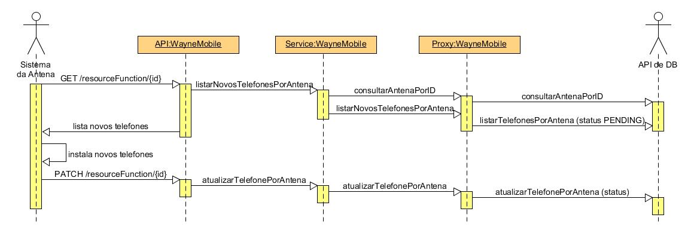
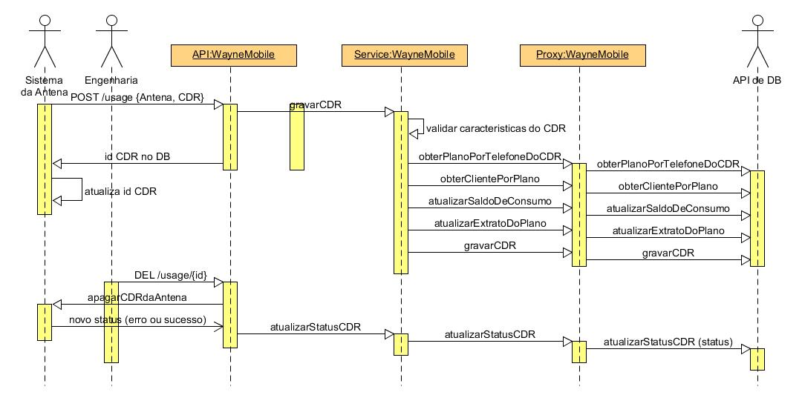

# API WayneMobile v1

### - References:

Github:  https://github.com/dcassiani/wayne-v1 

Travis: https://travis-ci.org/github/dcassiani/wayne-v1 

DockerHub: (ainda não criado)

### - Quick Start:	

Na raiz do projeto, executar o comando: *`mvn spring-boot:run`*

Swagger-UI será iniciado em: http://localhost:8080/swagger-ui.html 

As operações de teste estão nas guias de ClienteAntena e CDR

Operações de Health Check (para futura implementação de recovery e escalonamento dos pods Docker) disponível em: http://localhost:8080/actuator/health

## Objetivo:

- Criar a API WayneMobileV1, que faça inclusão e exclusão de CDRs, além de  inclusão de clientes, no banco de dados e antena, através de outras APIs (não especificadas), para "consumida" no aplicativo MeuVivo e "alimentada" por sistemas específicos de tecnologia e/ou engenharia das antenas.

- O aplicativo MeuVivo, de apresentação baseada na fatura telefônica, fornece o relacionamento de um dado cliente. Exibe um múltiplo de planos, sendo cada plano com um múltiplo de números de celular, e com as operações de consultar fatura aberta (atual) e as fechadas (até 12 meses), saldo de consumo (ligações, Internet, e SMS), e extratos detalhados (ligações, e acesso à Internet).

  

## Arquitetura:

- Contract-First: documentação que deve ser "viva e atual" com o código (contrato Swagger), de fácil utilização e compartilhamento entre diferentes áreas e profissionais (permite trabalho em paralelo, antes da conclusão do sistema), sendo um artefato exigido por API Gateways.

- Definido desenvolvimento de WebService REST feito em Framework Spring e Java, com pipeline de CI/CD em Travis, relatórios de qualidade técnica em Codecov, versionamento no Github, e ambientes de entrega e execução em DockerHub (Conteiners Docker).

- Para que os testes unitários e integrados sigam o pattern desejado, atentar aos construtores e seus parâmetros em relação à Injeção de Dependência: via de regra, construtores Autowired devem receber instâncias de classes de comunicação com outras APIs (Proxys, DAOs), para que possam também receber as instâncias mock (MockBean) em tempo de teste.

- APIs Comunicantes: além de se comunicar com o MeuVivo, o WayneMobileV1 também se conecta com APIs que acessam o DB, e APIs que acessam sistemas de antenas.

## Estórias/Tarefas:

##### Arquiteto quer Swagger para acordo e alinhamento das equipes técnicas

- Montar Swagger do serviço WayneMobileV1 (Operações: incluir e excluir CDR, incluir clientes)
- Validar com Arquitetura a necessidade de seguir padrão TM Fórum (padrão em Telefonia) no Swagger
- Validar Swagger com Equipe de Desenvolvimento do App MeuVivo
- Validar Swagger com Equipe de Desenvolvimento de Engenharia
- Entrega do Swagger final para Arquitetura de Integração (repositório do API Gateway)

##### Arquiteto de Integração quer garantir que o serviço e o Swagger sempre se reflitam para garantir integração dos sistemas comunicantes

- Desenvolvimento de serviço Spring Boot gerado por Swagger (CODEGEN em estágio de empacotamento da aplicação)
- Configuração de projeto/conta Github
- Versionamento do serviço WayneMobileV1 apenas gerado pelo codegen no branch Master
- Configurar branch de Mock do serviço WayneMobileV1 no GitHub
- Configurar branch de Develop do serviço WayneMobileV1 no GitHub

##### Administrador de Sistemas quer ambiente preparado para instalação do serviço

- Criar Dockerfile para Spring Boot e Java de instanciação/inicialização de Conteiner Docker
- Configuração de projeto/conta no DockerHub
- Montar arquivos de configuração de variáveis de ambiente para ambientes de desenvolvimento, teste, homologação e produção (incluir variáveis com endereço das das APIs comunicantes, serviços e rotas Docker, seguir padrão Docker e Spring Boot)
- Configurar projeto/conta no Travis de pipelines de CI/CD para os ambientes de desenvolvimento, teste, homologação e produção
- Instalar nos ambientes de desenvolvimento e teste o branch de Mock do WayneMobileV1 no primeiro momento

##### Testador quer ambiente de Teste Integrado para certificar que a operação do MeuVivo e dos sistemas de Engenharia não será impactada

- Obter contratos (Swagger ou WSDL) das APIs comunicantes
- Montar Mock das APIs comunicantes em Docker de teste para os desenvolvedores e testadores (usar Codegens, SoapUI, Postman ou similares simples) 
- Criar projeto de apoio dos Mocks das APIs comunicantes no Github, com mock de resposta de banco de dados quando necessário
- Configurar no projeto/conta do Travis, no pipeline de teste, fases de empacotamento e instanciação dos conteiners de Mock das APIs comunicantes
- Desenvolver em JUnit testes integrados das operações do WayneMobileV1 (branch: Mock)
- Configurar projeto/conta no Codecov, para criar fase de execução e publicação dos testes integrados no pipeline de teste do Travis

##### Testador quer ambiente de Teste Unitário para certificas que as lógicas de negócio serão protegidas

- Desenvolver teste unitário das operaçõe, com instâncias de Mock (@MockBean) de respostas de operações de sucesso das APIs do DB (branch: Develop)
- Desenvolver teste unitário das operações, com instâncias de Mock (@MockBean) de respostas de operações de sucesso das APIs de Antenas (branch: Develop)
- Realizar merge de branch de Mock com Develop, de forma que todos os perfis de ambiente e de CI/CD fiquem plenamente funcionais ao Squad

##### Cliente MeuVivo quer boa performance para ter boa experiência no aplicativo

- Configurar container com Redis nos ambientes locais, desenvolvimento, teste, homologação e produção, no projeto/conta DockerHub
- Atualizar arquivos de configuração de ambientes os endereços de servidores de cache Redis
- Desenvolver cenário de teste integrado, das operações de leitura ou listagem, que meça o tempo de resposta médio de 100 chamadas iguais (Assert: tempo médio encontrado deve ser menor que tempo médio estipulado por área de negócio como aceitável)

##### Engenharia quer incluir novo cliente no sistema da Antena Vivo para garantir operação móvel
- *Definition of Ready:* será montada a operação "GET /resourceFunction/{id}?state=newMobile&q=quantidade-pagina", que será chamado pelo sistema da Antena rotineiramente para obter novos números para registro na antena desse {id}. O WayneMobileV1 consultará, na API do DB, se esse {id} é uma antena, e uma lista de números de celular com o estado de Ainda Não Instalados para essa antena, limitado à quantidade especificada (quantidade por página e página desejada). Quando o sistema da Antena efetivar o registro, ele fará um callback de atualização de estado para Implantado ou Erro para a operação "PATCH /resourceFunction/{id}" para o WayneMobileV1, o qual chamará a API de DB para atualizar a base.
- Levantar com Engenharia quais as APIs de atualização dos DBs devem ser usadas (possibilidade de analise de Volumetria e criação de fila MQ para atender a demanda), e possível controle de novos números de clientes que só dão erros ao tentar ser instalados, para que não sejam listados para a antena novamente depois de X tentativas, por exemplo.
- Acertar os testes unitários e os integrados para refletir (mock) a chamada da Antena, o callback da Antena, a consulta de novos números da API do DB e sua paginação, a atualização do estado do registro na antena na API do DB   
- Desenvolver a classe RestController de "GET /resourceFunction/{id}?state=newMobile" como implementação do ApiDelegate gerado pelo CODEGEN, que chama a classe Service
- Desenvolver a classe de Service que orqueste a chamada aos Proxies das APIs de consulta conforme regra de negócio
- Desenvolver classe Proxy de consulta validadora de Antena à API de DB por ID da Antena
- Desenvolver classe Proxy de consulta de listagem de números para instalação na Antena pela API de DB
- Desenvolver a classe RestController do callback de "PATCH /resourceFunction/{id}" como implementação do ApiDelegate gerado pelo CODEGEN, que chama a classe Service
- Desenvolver na classe de Service a lógica de atualização do Callback de instalação de cliente novo na antena
- Desenvolver classe Proxy de atualização do estado de instalação de um número na relação de telefones instalados naquela Antena, usando a API de DB por ID da Antena e passando no payload identificador do celular e estado
- Versionar no branch Develop, implantar nos ambientes de Desenvolvimento e de Teste pelo pipeline do Travis

##### Engenharia quer listar CDR no extrato e saldo de consumo para disponibilizar para Clientes 

- *Definition of Ready:* será montada a operação "POST /usage", que será chamado pela sistema da antena para gravar os dados de um CDR no DB utilizado pelo MeuVivo para extratos e saldos - data, hora, local, antena, tipo de CDR (voz, sms, dados), lista de caracteristicas conforme necessário no DB (nome, valor, por exemplo duração, unidade de duração, numero de celular, id da antena, latitude da antega, longitude da antena, etc). O WayneMobileV1 então gravará no DB através das APIs de DB, e retornará para o sistema da Antena que esse CDR já foi internalizado ao DB e sob qual ID de CDR gerado, o qual o sistema da Antena deve associar ao CDR.
- Acertar os testes unitários e os integrados para refletir (mock) as chamada pela antena e as consultas e gravações dos dados pelo DB 
- Desenvolver o RestController da operação "POST /usage" como implementação do ApiDelegate gerado pelo CODEGEN, que chama a classe Service
- Desenvolver o Service que valida os metadados de características do CDR, obtém o telefone, encontra o plano e cliente associados ao telefone, e atualiza nas bases de CDR, de extrato, de saldo de consumo conforme recebido
- Desenvolver a classe de Proxy de consulta pelo telefone  para obter o plano e cliente associados pela API do DB
- Desenvolver a classe de Proxy de chamada para  gravar o CDR com os dados do plano e cliente pela API do DB, obtendo ID de registro em DB (retorno)
- Desenvolver a classe de Proxy de atualização do consumo de SMS, Internet ou telefonia do cliente pela API do DB
- Desenvolver a classe de Proxy de atualização de histórico/extrato do plano do cliente com  os dados gerados pelo CDR pela API do DB
- Versionar no branch Develop
- Implantar nos ambientes de Desenvolvimento e de Teste

##### Engenharia que excluir CDR do sistema após gravação nos DBs para manutenção da memória da antena

- *Definition of Ready:* criar operação "DEL /usage", que será chamado pelos sistemas de Engenharia para remover do sistema da Antena um CDR já gravado em DB, de maneira rotineira e assim liberar a memória da Antena
- Acertar os testes unitários e o integrados para refletir (mock) a chamada da Engenharia e refletir a resposta do sistema da Antena 
- Desenvolver o RestController da operação "DEL /usage" como implementação do ApiDelegate gerado pelo CODEGEN, que chama o Service, e traz sinal de sucesso ou erro
- Desenvolver classe Service que orquestra a Proxy de sistema da Antena
- Desenvolver a chamada na classe Proxy de exclusão do idCDR da antena, e recebimento do sinal de erro ou sucesso (retorno)
- Versionar no branch Develop
- Implantar nos ambientes de Desenvolvimento e de Teste